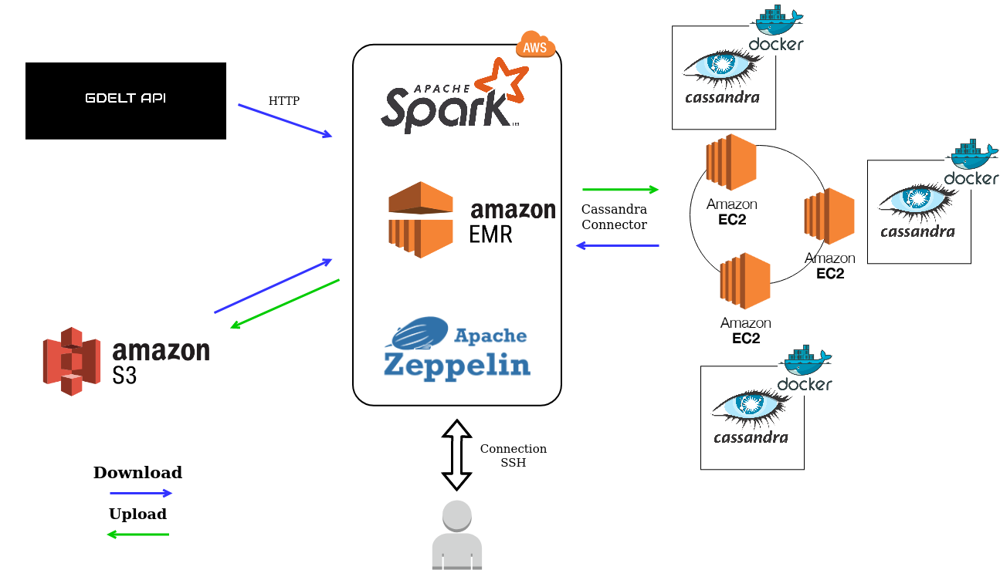

# GDELT PROJECT
<center>

</center>
## Goal of the project

This Project was done in the context of the Post Master Degree in Big Data at Telecom Paris.

The goal of the project was to retrieve data from the GDELT database, process it through four axis with Spark and upload it to a NoSql distributed database. The use of AWS was needed for calculation, and data storage.

Our database needed to be resilient to one node failure.

The four axis that leaded our work were:

1. Display the number of article for each tuple (day, country of the event, langage of the article)

2. For a given country, display the events that happen there by number of mention (in descending order). Aggregation on day, month or year should be possible.

3. For an input source (gkg.SourceCommonName), display themes, persons, locations, that are mentions in this article source. You will also display the number of article and the average tone for each theme/person and location. Aggregation on day, month and year should be possible.

4. Draw the map of relation between countries based on the article's tone. Compute the number of article and the average tone. Enable filter on year, month or day and country.  
We will introduce the different part of our work in the following parts.

## Table of Content
  - [GDELT Database](https://www.gdeltproject.org/)
    - [Event Table](#event-table)
    - [Mention Table](#mention-table)
    - [Global  Knowledge  Graph (GKG) Table](#global--knowledge--graph-gkg-table)
- [GDELT PROJECT](#gdelt-project)
  - [Goal of the project](#goal-of-the-project)
  - [Table of Content](#table-of-content)
- [GDELT Database](#gdelt-database)
    - [Event Table](#event-table)
    - [Mention Table](#mention-table)
    - [Global  Knowledge  Graph (GKG) Table](#global-knowledge-graph-gkg-table)
- [Architecture of the project](#architecture-of-the-project)
  - [Database Architecture](#database-architecture)
  - [General Architecture](#general-architecture)
- [How to run the project](#how-to-run-the-project)
  - [Prerequisites](#prerequisites)
  - [Creation of the cluster](#creation-of-the-cluster)
  - [Verification that the cluster is working correctly](#verification-that-the-cluster-is-working-correctly)

# [GDELT Database](https://www.gdeltproject.org/)

Supported by Google Jigsaw, the GDELT Project monitors the world's broadcast, print, and web news from nearly every corner of every country in over 100 languages and identifies the people, locations, organizations, themes, sources, emotions, counts, quotes, images and events driving our global society every second of every day, creating a free open platform for computing on the entire world.

The GDELT Database is composed of 3 table:

### Event Table

The GDELT Event Database records over 300 categories of physical activities around the world, from riots and protests to peace appeals and diplomatic exchanges, georeferenced to the city or mountaintop, across the entire planet dating back to January 1, 1979 and updated every 15 minutes.

Essentially it takes a sentence like "The United States criticized Russia yesterday for deploying its troops in Crimea, in which a recent clash with its soldiers left 10 civilians injured" and transforms this blurb of unstructured text into three structured database entries, recording US CRITICIZES RUSSIA, RUSSIA TROOP-DEPLOY UKRAINE (CRIMEA), and RUSSIA MATERIAL-CONFLICT CIVILIANS (CRIMEA).

Nearly 60 attributes are captured for each event, including the approximate location of the action and those involved. This translates the textual descriptions of world events captured in the news media into codified entries in a grand "global spreadsheet."

You can find more detail about the fields [here](http://data.gdeltproject.org/documentation/GDELT-Event_Codebook-V2.0.pdf)

A BigQuerry table is also accessible [here](https://bigquery.cloud.google.com/table/gdelt-bq:gdeltv2.events?tab=schema)

### Mention Table

The Mentions table records each mention of the events in the Event table, making it possible to track the trajectory and network structure of a story as it flows through the global media system.  Each mention of an event receives its own entry in the Mentions table –thus an event  which  is  mentioned  in  100  articles  will  be  listed  100  times  in  the  Mentions  table.    Mentions  are recorded irrespective of the date of the original event, meaning that a mention today of an event from a year ago will still be recorded, making it possible to trace discussion of “anniversary events” or historical events  being  recontextualized  into  present  actions.    If  a  news  report  mentions  multiple  events,  each mention  is  recorded  separately  in  thistable.

You can find more detail in the [same cook book as event](http://data.gdeltproject.org/documentation/GDELT-Event_Codebook-V2.0.pdf)

A BigQuerry table is also accessible [here](https://bigquery.cloud.google.com/table/gdelt-bq:gdeltv2.eventmentions)

### Global  Knowledge  Graph (GKG) Table

To sum up the GKG in a single sentence, it connects every person, organization, location, count, theme, news source, and event across the planet into a single massive network that captures what’s happening around the world, what its context is and who’s involved, and how the world is feeling about it, every single day.

You can find more detail about the fields [here](http://data.gdeltproject.org/documentation/GDELT-Global_Knowledge_Graph_Codebook-V2.1.pdf)

A BigQuerry table is also accessible [here](http://data.gdeltproject.org/documentation/GDELT-Global_Knowledge_Graph_Codebook-V2.1.pdf)


# Architecture of the project

## Database Architecture
We choosed to use a cassandra database for our work implemented in a docker environment. 
Casddandra was a good fit for our project since it easily implemented the resilience part. Cassandra is a highly available database, since there is a huge amount of write and potentially read input/ output of data, cassandra is suitable. 

The issue of cassandra are possible inconsistency in our data. But it is not an issue here in our application. Another issue is the lack of efficient aggregation request in cassandra. We will solve this by doing some post processing with spark after retrieving our data.

We decided to implement our database in a docker environment to ease the deployment of the cluster. It enabled us to create an automated ansible playbook for deployment.

As for table we are not going to develop the choice of partition and clustering key here but you can find the schema in `cassandra/schema` folder.

## General Architecture



The processus we use to run our project is the following:

1. Run a AWS EMR instance and retrieve the data (.zip format) from GDELT. 
2. Store those data in a S3 bucket
3. Retrieve the data and apply calculation with Spark (with an EMR)
4. Optional: Save the final Dataframe table in parquet fromat in a S3 Bucket
5. Create Keyspace and table in Cassandra 
6. Load Dataframe in cassandra 
7. Request the database 

# How to run the project

**Warning**: Running this project could cost you money !

```
git clone git@github.com:vincrichard/GDELT_Project.git
cd GDELT_Project
```

## Prerequisites


Install the following tools in local:

* [aws2 cli](https://docs.aws.amazon.com/cli/latest/userguide/install-cliv2-linux-mac.html) aws console command line utility.
* [ansible](https://docs.ansible.com/ansible/latest/installation_guide/intro_installation.html) a devOps tool to ease multiple task.

* Create a ```~./aws/credentials``` file with your credentials and region specify.
  
 Exemple:

 ```shell
[default]
aws_access_key_id=your_id
aws_secret_access_key=your_key
aws_session_token=your_token # Only for Educate Account
region=your_region
 ```

 * Change the vars in the ```playbook/ansible.ini``` to fit your spec. You have to change:
    - `path_pem` : path to your *.pem key enabling the creation of the cluster.
    - `aws_key_name` : name of your key in aws
    - `security_group_name` : name of the security group to use (default ElasticMapReduce-master) (**!** This security group must enable ssh connection)
    - (Optional) `count` : the count argument to choose the number of instance in the cluster. (Default is 2, after that you will need to wait 2 minutes for each supplementary node for gossip state to propagate)

  
## Creation of the cluster 

To start the cluster we run an ansible playbook with the following command: 

```
ansible-playbook playbook/cassandra-laucher.yaml
```

After that you should have all your EC2 instances running a docker cassandra image.

## Verification that the cluster is working correctly

Go to aws and copy a public DNS adress, then connect through ssh with:

```ssh -i path_to_your_key.pem ubuntu@your_ec2_DNSAdress```

To verify the docker is running:
```
ubuntu@ip-172-31-37-126: sudo docker container ls
CONTAINER ID        IMAGE               COMMAND                  CREATED              STATUS              PORTS                                                            NAMES
bc4c95883803        cassandra:latest    "docker-entrypoint.s…"   About a minute ago   Up About a minute   7001/tcp, 7199/tcp, 9042/tcp, 0.0.0.0:7000->7000/tcp, 9160/tcp   cassandra-gdelt
```

Connect to your docker container:
```sudo docker exec -it cassandra-gdelt bash```

Then to verify there is the right number of node on the cluster:

```shell

root@bc4c95883803: nodetool status
Datacenter: datacenter1
=======================
Status=Up/Down
|/ State=Normal/Leaving/Joining/Moving
--  Address        Load       Tokens       Owns (effective)  Host ID                               Rack
UN  172.31.37.126  108.66 KiB  256          100.0%            a04f8414-8047-4250-8552-c351631897fc  rack1
UN  172.31.35.123  69.88 KiB  256          100.0%            3455aa7f-1673-480d-b5ec-98c5f9d2ece0  rack1
```

Go to the cql console:
```cqlsh```

Now input some data for testing:
```
cqlsh> CREATE KEYSPACE temperature WITH replication = {'class': 'SimpleStrategy', 'replication_factor': 2}; 

cqlsh> USE temperature;
cqlsh:temperature> CREATE TABLE temperature1 (
                       ville text,
                       temperature int,
                       PRIMARY KEY (ville)
                  );

cqlsh:temperature> INSERT INTO temperature1(ville, temperature ) VALUES ( 'Paris', 30);
```
Now let's see if we can read those data from the outside !

## Connection to the database

### Quick test

- Start an EMR instance in AWS
- Connect through ssh to it
```
  ssh -i path_to_key.pem hadoop@your_emr_ssh \
-L 8088:127.0.0.1:8088 \
-L 8042:127.0.0.1:8042 \
-L 50070:127.0.0.1:50070 \
-L 18080:127.0.0.1:18080 \
-L 8890:127.0.0.1:8890 \
-L 16010:127.0.0.1:16010 
```
- Go in aws to check one of the public ip of your Cassandra cluster
- Use the following command line with the right path to your key.pem file and the right ipadress to connect to the spark-shell:
```
spark-shell --conf spark.cassandra.connection.host=ec2_ip_adress --packages datastax:spark-cassandra-connector:2.4.0-s_2.11
```

And then run the following code:
```shell
scala> import com.datastax.spark.connector._ 
import com.datastax.spark.connector._

scala> val rdd = sc.cassandraTable("temperature", "temperature1") 
rdd: com.datastax.spark.connector.rdd.CassandraTableScanRDD[com.datastax.spark.connector.CassandraRow] = CassandraTableScanRDD[0] at RDD at CassandraRDD.scala:18

scala> rdd.collect 
res0: Array[com.datastax.spark.connector.CassandraRow] = Array(CassandraRow{ville: Paris, date: 2016-12-01 00:00:00+0100, temperature: 30})
```
Okay your connection clustering is working you can work on the notebook !

Don't forget to **terminate your instances** !

