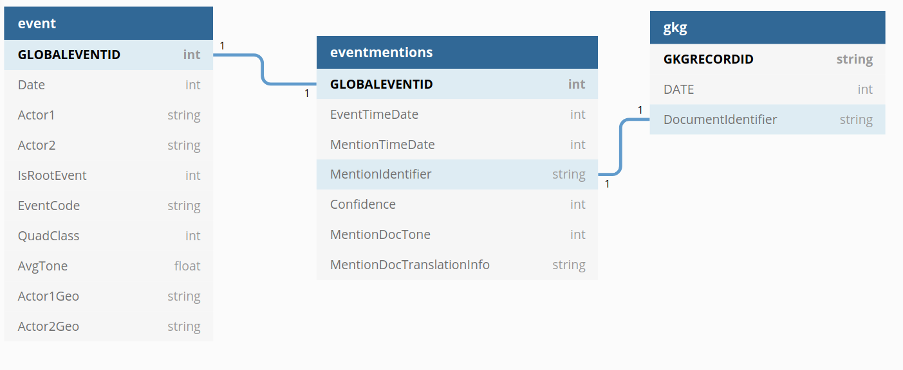

# Presentation of the database GDELT

Supported by Google Jigsaw, the GDELT Project monitors the world's broadcast, print, and web news from nearly every corner of every country in over 100 languages and identifies the people, locations, organizations, themes, sources, emotions, counts, quotes, images and events driving our global society every second of every day, creating a free open platform for computing on the entire world.

https://www.gdeltproject.org/

## EVENT Table

The GDELT Event Database records over 300 categories of physical activities around the world, from riots and protests to peace appeals and diplomatic exchanges, georeferenced to the city or mountaintop, across the entire planet dating back to January 1, 1979 and updated every 15 minutes.

Essentially it takes a sentence like "The United States criticized Russia yesterday for deploying its troops in Crimea, in which a recent clash with its soldiers left 10 civilians injured" and transforms this blurb of unstructured text into three structured database entries, recording US CRITICIZES RUSSIA, RUSSIA TROOP-DEPLOY UKRAINE (CRIMEA), and RUSSIA MATERIAL-CONFLICT CIVILIANS (CRIMEA).

Nearly 60 attributes are captured for each event, including the approximate location of the action and those involved. This translates the textual descriptions of world events captured in the news media into codified entries in a grand "global spreadsheet."

http://data.gdeltproject.org/documentation/GDELT-Event_Codebook-V2.0.pdf

Event Geography:

 * The Action fields capture the location information closest to the point in the event description that contains the actual statement of actionand is the best location to use for placing events on a map or in other spatial context

 * To  find  all  events  located  in  or  relating  to  a  specific  city  or  geographic  landmark,  the  Geo_FeatureID column  should  be  used,  rather  than  the  Geo_Fullname  column. 

 * When looking for events in or relating to a specific country, such as Syria, there are two possible filtering methods.    The  first  is  to  use  the  Actor_CountryCode  fields  in  the  Actor  section  to  look  for  all  actors havingthe  SYR  (Syria)  code
 * The second method is to examine the  ActorGeo_CountryCode  for  the  location  of  the  event.    This  will  also  capture  situations  such  as  the United States criticizing a statement by Russia regarding a specific Syrian attack

## Mention Event Table 

The Mentions table is a new addition to GDELT 2.0 and records each mention of the events in the Event table, making it possible to track the trajectory and network structure of a story as it flows through the global media system.  Each mention of an event receives its own entry in the Mentions table –thus an event  which  is  mentioned  in  100  articles  will  be  listed  100  times  in  the  Mentions  table.    Mentions  are recorded irrespective of the date of the original event, meaning that a mention today of an event from a year ago will still be recorded, making it possible to trace discussion of “anniversary events” or historical events  being  recontextualized  into  present  actions.    If  a  news  report  mentions  multiple  events,  each mention  is  recorded  separately  in  thistable.For  translated  documents,  all measures  below  are  based on its English translation

## GKG (Global Knowledge Graph) table

http://data.gdeltproject.org/documentation/GDELT-Global_Knowledge_Graph_Codebook-V2.1.pdf

V2.1TRANSLATIONINFO.    (semicolon-delimited  fields)  This  field  is  used  to  record  provenance information  for  machine  translated  documents  indicating  the  original  source  language  and  the citation of the translation system used to translate the documentfor processing.  It will be blank for  documents  originally  in  English.

# Fonctionnalités Nécessaire

## Fonctionalités de base 

Votre système doit être capable de:
 * afficher le nombre d’articles/évènements qu’il y a eu pour chaque triplet (jour, pays de l’évènement, langue de l’article).
    
GKG table:

>  Group By sur:
>   - DATE
>   - V2Locations 
>   - TRANSLATIONINFO : langue de l'article
> Puis un count 

 * pour un pays donné en paramètre, affichez les évènements qui y ont eu place triées par le nombre de mentions (tri décroissant); permettez une agrégation par jour/mois/année
Event Table:

> SELECT GLOBALEVENTID 
> WHERE Pays = Actor1Geo_ADM2Code 
> GROUP BY: DATE
> ORDER BY: NumMentions DESC
 

 * pour une source de donnés passée en paramètre (gkg.SourceCommonName) affichez les thèmes, personnes, lieux dont les articles de cette sources parlent ainsi que le le nombre d’articles et le ton moyen des articles (pour chaque thème/personne/lieu); permettez une agrégation par jour/mois/année.

GKG table:

> SELECT: 
> V2Themes, V2Persons, V2Locations , V2Tone, Count
> WHERE Source donné == SourceCommonName
> GROUP BY Date

 * dresser la cartographie des relations entre les pays d’après le ton des articles : pour chaque paire (pays1, pays2), calculer le nombre d’article, le ton moyen (aggrégations sur Année/Mois/Jour, filtrage par pays ou carré de coordonnées)

GKG table:

> SELECT TranslationInfo, V2Locations , V2Tone, Count 
> GROUP BY Date

## Reduction de la Base de donnée pour notre étude

</img>

Les éléments de la table *event* et *eventmention* semblent être suffisant pour le cadre de notre étude.

# Modelisation et choix de la Base de donnée

